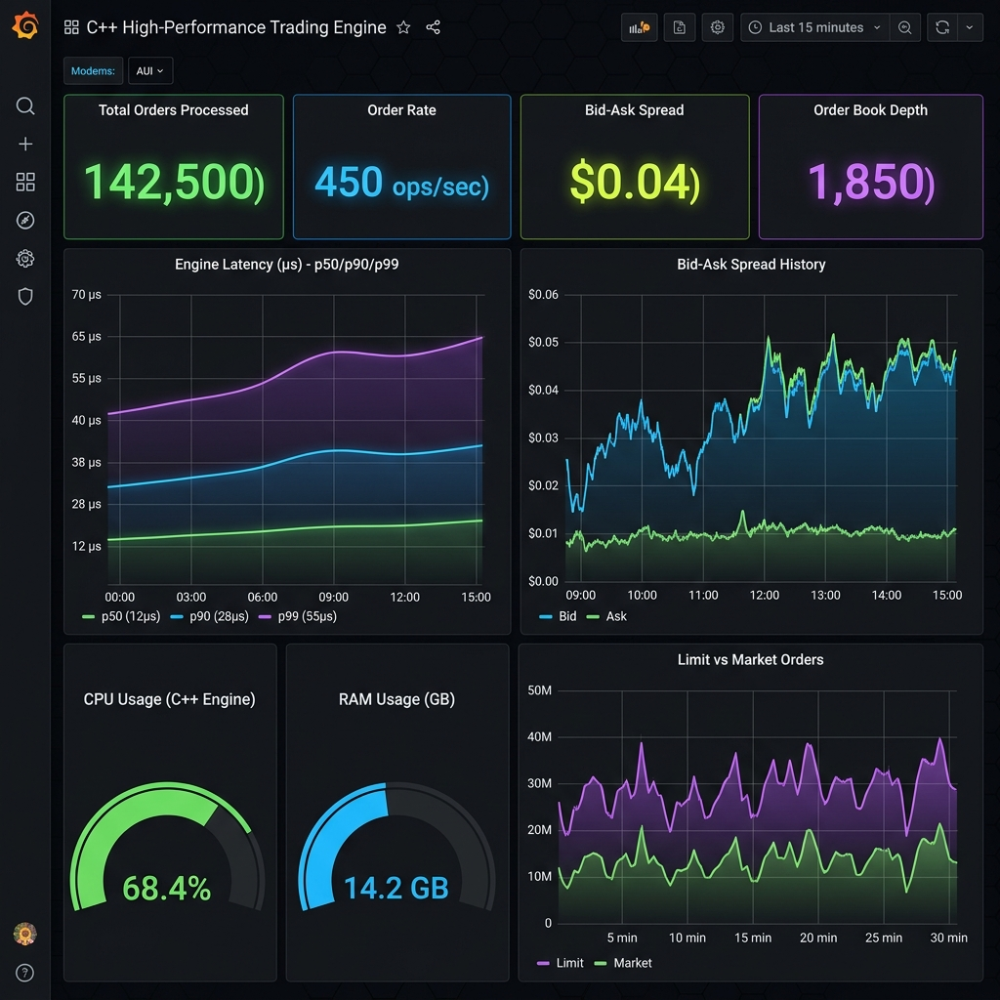

# High-Performance C++ Trading Telemetry Engine with Grafana & Prometheus

Un système complet de métriques et de télémétrie temps réel mariant le langage **C++ (C++17)** et la plateforme d'observabilité **Grafana** (via Prometheus).



> 💡 **Aperçu interactif dans le navigateur** : Ouvrez directement [dashboard_preview.html](dashboard_preview.html) dans n'importe quel navigateur pour tester le tableau de bord animé en temps réel.

---

## 🏗️ Architecture du Projet

```
 ┌────────────────────────────────────────────────────────┐
 │           C++ Trading Telemetry Engine                │
 │  - Simulation d'Order Book & Exécution multi-thread    │
 │  - Metrics Store Thread-safe (Counters, Gauges, Hist)  │
 │  - Serveur HTTP C++ embarqué (Port 8080)               │
 └───────────────────────────┬────────────────────────────┘
                             │ Scrape /metrics (1s interval)
                             ▼
 ┌────────────────────────────────────────────────────────┐
 │                      Prometheus                        │
 │  - Service de collecte TSDB (Port 9090)               │
 └───────────────────────────┬────────────────────────────┘
                             │ Requêtes PromQL
                             ▼
 ┌────────────────────────────────────────────────────────┐
 │                       Grafana                          │
 │  - Dashboard Temps Réel Auto-provisionné (Port 3000)   │
 └────────────────────────────────────────────────────────┘
```

---

## ⚡ Fonctionnalités principales

1. **Moteur C++ Multi-threaded (`src/trading_engine.hpp`)** :
   - Simulation d'arrivée et d'exécution d'ordres (*limit* & *market*).
   - Calcul des latences d'exécution en microsecondes ($\mu s$).
   - Simulation dynamique du spread Bid-Ask, de la profondeur du carnet d'ordres et de l'empreinte système (CPU, RAM).

2. **Format d'Exposition Prometheus (`src/metrics_exporter.hpp`)** :
   - **Counters** : `trading_orders_processed_total{type="limit|market"}`
   - **Gauges** : `trading_bid_ask_spread_dollars`, `trading_order_book_depth`, `trading_engine_cpu_percent`, `trading_engine_memory_bytes`
   - **Histograms** : `trading_order_latency_microseconds` avec calculs de centiles (p50, p90, p99).

3. **Dashboard Grafana Auto-provisionné (`config/grafana/dashboards/trading_telemetry.json`)** :
   - Tableau de bord pré-configuré chargé automatiquement dès le démarrage du conteneur.
   - 8 panneaux d'affichage interactifs (Taux d'opérations/sec, Heatmaps de latence, Jauges de spread, Courbes CPU/RAM).

---

## 🚀 Démarrage Rapide

### Prérequis
- [Docker Desktop](https://www.docker.com/products/docker-desktop/) installé et démarré.

### 1. Lancer la stack complète
Exécutez la commande suivante à la racine du projet :

```bash
docker compose up --build -d
```

### 2. Accéder aux Interfaces Web

| Service | URL | Description |
| :--- | :--- | :--- |
| **Grafana Dashboard** | `http://localhost:3000` | Identifiants : `admin` / `admin` (Dashboard chargé automatiquement) |
| **Prometheus UI** | `http://localhost:9090` | Interface de requêtes PromQL |
| **C++ Metrics Endpoint** | `http://localhost:8080/metrics` | Flux texte des métriques Prometheus du C++ |
| **C++ Health Check** | `http://localhost:8080/health` | Statut du moteur C++ |

---

## 📁 Structure du Code Source

```
cpp-grafana-telemetry/
├── Dockerfile                      # Compilation C++ multi-stage (Alpine/GCC)
├── docker-compose.yml              # Orchestration (C++ Engine + Prometheus + Grafana)
├── dashboard_preview.html          # Aperçu HTML interactif temps réel
├── Makefile                        # Raccourcis de commandes
├── README.md                       # Documentation du projet
├── docs/
│   └── dashboard_preview.png       # Capture visuelle du dashboard Grafana
├── config/
│   ├── prometheus.yml              # Configuration du scraping Prometheus (1s)
│   └── grafana/
│       ├── datasources/
│       │   └── datasource.yml      # Connexion automatique à Prometheus
│       └── dashboards/
│           ├── dashboard.yml       # Déclaratif du provider de dashboards
│           └── trading_telemetry.json # Code JSON du tableau de bord Grafana
└── src/
    ├── main.cpp                    # Serveur HTTP C++ & gestion des signaux
    ├── metrics_exporter.hpp        # Convertisseur de métriques au format Prometheus
    └── trading_engine.hpp          # Logique multi-thread du moteur d'ordres
```

---

## 🛠️ Commandes Utiles (Makefile)

- `make up` : Lance la stack Docker en arrière-plan.
- `make logs-cpp` : Affiche les logs en direct du moteur C++.
- `make test-metrics` : Vérifie l'output texte brut du C++ sur `http://localhost:8080/metrics`.
- `make down` : Arrête tous les conteneurs.
